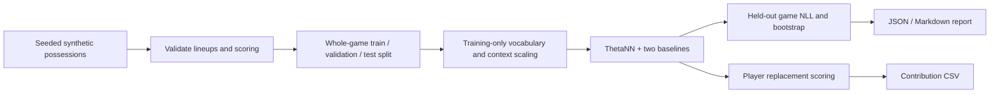

# Basketball Player Evaluation Model

Basketball outcomes belong to lineups, but analysts often need to explain each player's offensive and defensive contribution. This project fits a PyTorch possession model, compares it with simpler baselines, and estimates how predicted scoring changes when one player is replaced by a reference player.

**Working output:** a deterministic CPU demo trains three models on **3,072 invented possessions across 64 synthetic games**, then produces a baseline comparison, uncertainty intervals, and 24 player contribution estimates. The included run reaches test negative log likelihood **0.925248**, compared with **1.049246** for an additive one-hot baseline. These are synthetic demonstration results, not NBA ranking accuracy. [Read the generated report](reports/evaluation.md).

**My contribution:** I developed the player embedding model, masked event losses, possession transformations, baseline comparisons, and contribution-scoring approach. This release packages the mean-pooling model core with a small, independently runnable data contract and offline example. The engineering focus is measurable behavior: preventing data leakage, checking label consistency, comparing alternatives, and reporting a failed gate as a failed gate.

## Run the example

Use **64-bit Python 3.13** on Windows or Linux. No GPU, credentials, downloads of basketball data, or paid services are needed. Installation requires internet access; the example runs offline afterward. Allow about 1 GB of disk space for the environment and 2 GB of RAM. The CPU demo takes roughly 5–15 seconds on a recent laptop; dependency installation takes longer.

```bash
git clone https://github.com/Shaboxx/basketball-player-evaluation.git
cd basketball-player-evaluation
python -m venv .venv
```

Activate the environment with `.venv\Scripts\Activate.ps1` in PowerShell, or `source .venv/bin/activate` on Linux. Then run:

```bash
python -m pip install -r requirements.txt
python -m pip install --no-build-isolation --no-deps -e .
python -m player_value.demo
python -m unittest discover -s tests -v
```

Expected output for the pinned environment:

```text
Synthetic corpus: 3,072 possessions across 64 games
context_only   test NLL: 1.092028
one_hot        test NLL: 1.049246
theta_nn       test NLL: 0.925248
```

The command writes `output/demo/evaluation.md`, `evaluation.json`, `player_scores.csv`, and the exact normalized input `fixture.jsonl`. All output is computed by the command. Minor floating-point differences can occur across operating systems and CPU builds. Repeating the run in the same environment uses the same data, initialization, training schedule, and game bootstrap. The [committed report](reports/evaluation.md) and [machine-readable evaluation](reports/evaluation.json) were produced by this public command.

## What the scores mean

- **Offense:** how many more points the model expects per 100 possessions with a player than with an eligible reference player in those observed lineups and contexts.
- **Defense:** how many fewer points the model expects opponents to score under the same kind of replacement. Positive values are favorable on both sides.
- **Total:** offensive plus defensive contribution. Scores are centered by appearance counts, so the reference population has an average of zero on each side.

The example evaluates every eligible replacement among the other trained players in the same season, excluding players already on either side of the possession. It reports separate offensive and defensive sample counts and flags insufficient support. This is a model-based, context-dependent comparison. It does not establish a causal effect or identify a unique allocation of credit among strongly correlated teammates.

## Implementation



`ThetaNN` preserves the implemented mean-pooling core: player-season embeddings, separate offensive and defensive intercepts, four pre-possession context features, a season embedding, and a two-layer neural network. Six prediction heads cover points, turnovers, shot zone, make/miss, offensive rebounds, and free-throw points. Event-specific losses apply only when an event exists; missing events do not become negative labels. The unknown-player row stays zero after every optimizer update.

This compact demonstration uses 8-dimensional player embeddings, layers of 32 and 16 units, no dropout, and 100 full-batch Adam epochs. Validation NLL selects each model's checkpoint; the test games never drive checkpoint selection. Auxiliary losses have weight 0.1. The additive baseline's player table starts at zero. Full hyperparameters, histories, inputs, and transformations are inspectable. See the [data contract](docs/data-contract.md) and [evaluation methodology](docs/evaluation.md).

The released code covers the normalized-data boundary, model fitting, two baselines, replacement scores, and reproducible reporting. It does not include a live data collector, trained NBA checkpoint, expanded model variants, or the complete historical evaluation harness. The fixture contains at most one shot attempt per possession and does not model offensive-rebound continuations.

## Evaluation and evidence

| Evidence | Dataset | What it establishes |
|---|---|---|
| Reproduced public demo | 3,072 synthetic possessions; 64 games; 24 invented players | The released pipeline runs, compares models, and produces inspectable scores |
| Historical development corpus | 1,396,353 normalized possessions; 7,230 games; 2020–21 through 2025–26 | The recorded data scope, independently checked against row and distinct-game counts |
| Historical saved evaluation | 2024–25 evaluation origin; 237,154 possessions and 1,230 games | Some evaluation gates passed and others failed; not a claim of overall validity |

The historical corpus is **not one training split**. For the documented 2024–25 origin, fitting used 896,246 possessions from 4,647 games, early stopping used 23,497 possessions from 123 games, and origin evaluation used 237,154 possessions from 1,230 games. The 2025–26 rows are part of the broader corpus and were not included in that origin's fitting or evaluation.

The saved historical point-prediction gate passed; the team-level EPM non-inferiority gate failed, and the separate planted player-recovery suite also failed. A team-permutation check passed. These records do **not** support claiming that the model outperformed EPM as a player-value measure or that all gates passed. Historical results are archived observations and are not reproduced by the synthetic example. [Inspect the scope and historical gate details](docs/historical-results.md).

The synthetic generator deliberately makes lineup signal learnable. Its confidence intervals reflect 12 held-out games from one seed, not model uncertainty across realistic seasons. The one-hot baseline ties each player's offensive and defensive class effects with opposite signs, while the fixture generates separate offensive and defensive skills. Its lower capacity means the comparison is not an isolated test of neural architecture. Real use would require rights-cleared data, stronger lineup support checks, temporal evaluation, calibration analysis, and evidence that player-level estimates remain useful under correlated lineups and changes in team context.

## Project history, data, and licensing

Development records place the model core in August 2026. This repository is a public-release snapshot prepared on **September 20, 2026**, followed by current-dated commits for the runnable example, evaluation, and documentation. It does not represent the historical training runs as new experiments or recreate an earlier contribution timeline.

All distributed example players, lineups, and outcomes are generated by this repository. No NBA play-by-play, third-party player ratings, media, or checkpoints are distributed. Historical tables contain aggregate counts and evaluation summaries only. See [third-party notices and methodological references](THIRD_PARTY.md) and [license status](LICENSE_STATUS.md).
